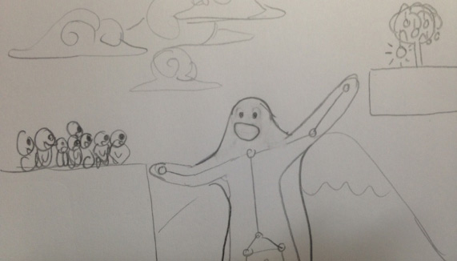

_by kikko_

### Week 1 progress 

We've been able to work a little bit on our project submission!

All we had from last week was something like this statement :

	We want to use technology to create a fun and poetic digital experience,
	close to the things that we love to do, watch and feel.
	
#### • Technical considerations
A typical, yet controversy, entry point for making art with code is knowing what technologies we want to work with. Usually this part has already been done by developping prototypes that are then discussed with other members of the collective (designers, developers..etc).

These prototypes are usually purely technical and very briefly documented. Just enough to explain what they do or can do. You can see some of mine on [my flickr](http://www.flickr.com/photos/kikko_fr/).

Considering the competition context and specifications, there are a couple technologies that we already knew we wanted to use. And that helped Beatrice and I to see where to go on the creative side.

- First one is **Google Chrome**.
I used it for the front-end of my latest commercial interactive installation instead of a C++ OpenGL app, and it saved me countless hours on styling and updating the style according to sliding specifications. It's large user base and developers make it very robust and many tools are available to optimize the workflow.

- Second one is **Body Tracking**. Even though many great pieces have already well explored the capabilities of this technique, I've always been frustrated that amongst all the prototypes I made based on it, none actually ended up in an actual project (appart from the former jump detection of [playtime](http://playtime.lab212.org)). So researchs were accentuated on topics that could use our knowledge on this technique.

- Third one are **Web Sockets**.
There is something fascinating in the feeling you get when you enter a _**live digital space**_. A world with its own rules that have to be discovered. With people. With a history, and ongoing stories..

#### • Interaction considerations
Parallel to the technical considerations, the interactions we want to work on often guide our creative process. We always discuss of interactions that we found interesting in our lives and see how they could apply to an interactive installation.

It doesn't mean we necessarily want to use them **as** interactions, but instead **_take their interesting, sensible part and transform it into new digital interactions._**

As an example, here are a few examples of interactions that we have or want to implement in an installation :

- adjust your body to fit a certain space, match a certain shape
- touching someone else's skin or being touched by someone else's skin
- pulling something out of your body, from your ears, your nose..etc
- blowing on a windmill
- decorating yourself
- turn a page
- cutting, tearing...etc

Something recurent, is the notion of embodiement.
A nice book that treats the subject comprenhensively is _[Interactive Art and Embodiment: The Implicit Body as Performance](http://implicitbody.net/)_ by Nathaniel Stern.

#### • First ideas

**_It's actually really hard to tell a simple, compeling story around an interaction without making a game._**

Even though we love games, we don't want to give interaction the biggest part in this piece.

We had to somehow let down one of the first idea we really liked because its game mechanic was too present :

_(very bad) drawing by kikko to explain the first idea_

This idea is split in 2 parts :

- The first part is an **interactive installation** where you embody a big giant that helps littles roundy creatures to reach an object by letting them jump on you, walk over your arms and head, protecting them from big falling rocks..etc
- The second one is **a web mobile app**. By visitting this web app, you start controlling one of the little roundy creature. You can walk and jump, and you quickly realise that you need the help of the big giant to reach your goal.

After much thinking and talking, we decided to keep searching for a better approach to this embodiment idea, with more space for **poetry and contemplation**

So we looked again at our references, a collection of pieces we love, to see how they could inspire our work to the better.

#### • References

##### Body decoration

Decorating the human body is a good thing to do. As a child, as an artist, as a warrior, everyone at some scale, spends time decorating his body.
Following are some pieces that had echoed in our discussions, amongst an endless amount of amazing artists and works studying this topic.

[Phyllis Galembo : West African Masquerade](http://www.itsnicethat.com/articles/phyllis-galembo)

[Solipsist, directed by Andrew Thomas Huang](https://vimeo.com/37848135)

[Hans Silvester - Natural Fashion: No. 127](https://www.google.fr/search?q=Hans+Silvester+-+Natural+Fashion:+No.+127&source=lnms&tbm=isch&sa=X&ei=hXMCU4LRNI2U0QWCjYDgDQ&ved=0CAkQ_AUoAQ&biw=1163&bih=638)

##### Further body studies

We were also interested by artist that end up completely omitting the human body and only kept the decoration, forming strange, yet quickly recognizable silhouettes.

[Universal Everything : The Transfiguration](http://www.universaleverything.com/projects/thetransfiguration/)

[Universal Everything : Tai chi](http://www.universaleverything.com/projects/tai-chi/)

[Klaus Enrique Gerdes: Arcimboldo](http://www.klausenrique.com/arcimboldo.html)

##### Interaction

Here are some obvious interaction references that we admire and that you would definitely checkout if you haven't yet!

[Philip Worthington: Shadow Monster](https://www.moma.org/visit/calendar/exhibitions/1346)

[Chris Milk: The Treachery of Sanctuary](http://milk.co/treachery)

This one is a little less obvious but still definitely worth a look (and try) :

[Nicolas Barradeau: Hydra](http://barradeau.com/2013/hydra)

##### Mood

Last but not least, any poetic experience has a mood. And we like to define and show each other beforehand what we feel like the mood should be like.

[Masanobu Hiraoka: Land](https://vimeo.com/74114715)

[VectorPark: Windosill](http://windosill.com/online/)

[VectorPark: Feed the Head](http://www.feedthehead.net/)

----

##### Conclusion

Little time and poor english skills prevent me from detailling how much we love all these references and why.
However our final piece will try to integrate some of this love and show it through a medium we manipulate better than words.

One thing is sure, is that we are very excited to start prototyping our **current** idea! And we will share in the next post some of the sketches Beatrice has already done for it!

Good times!
