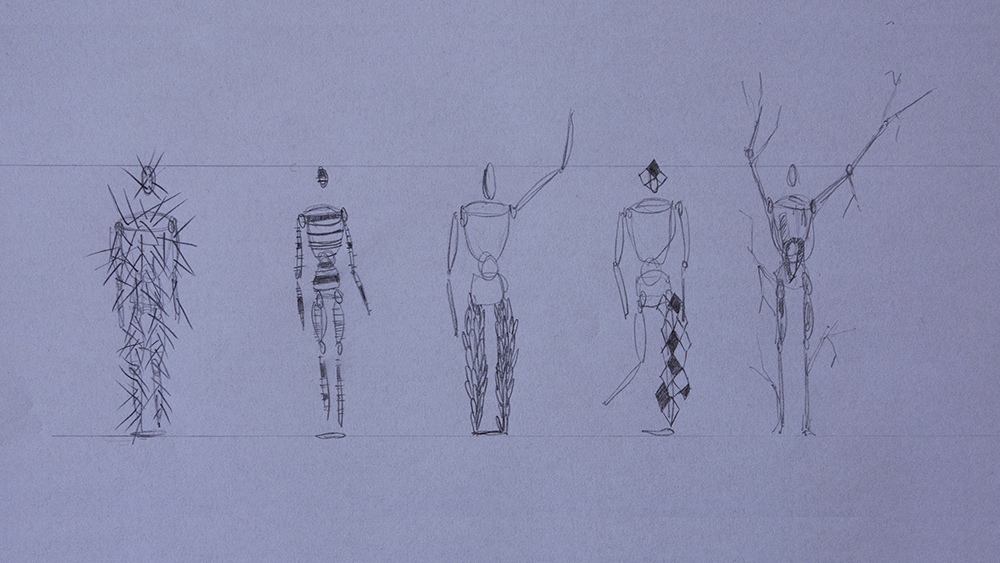
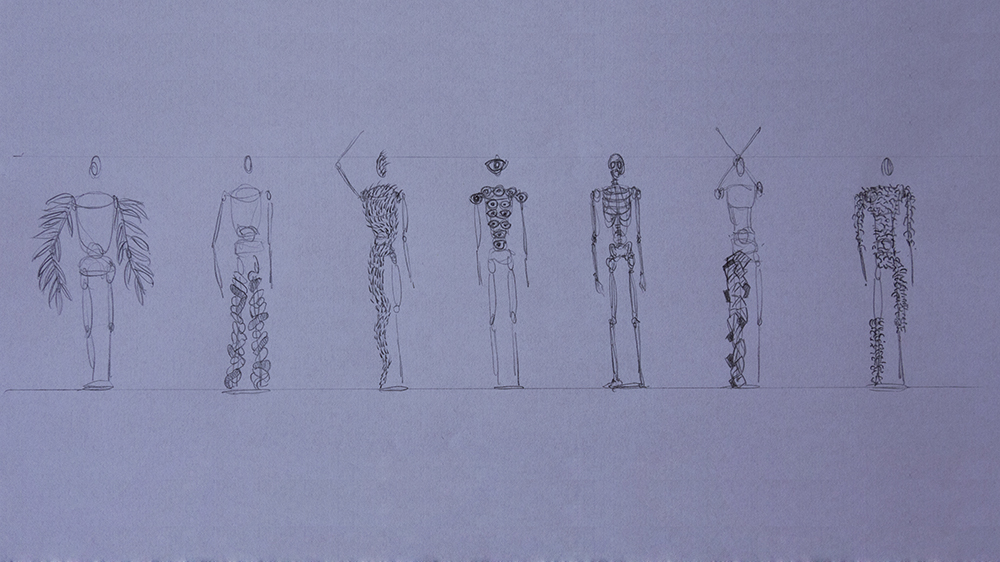
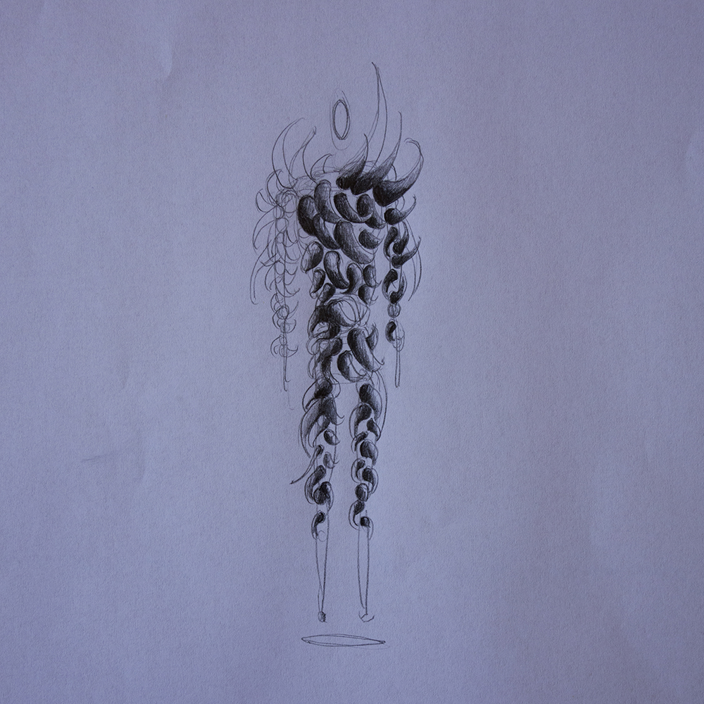
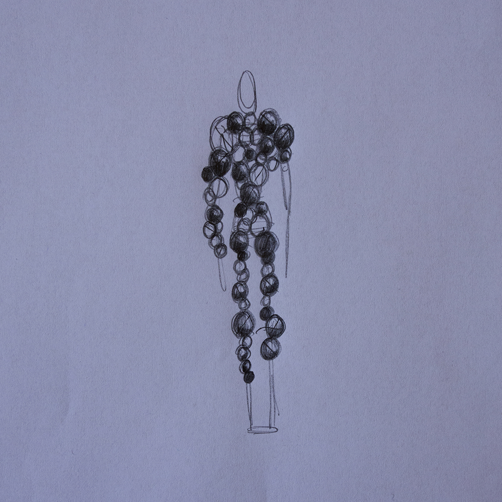
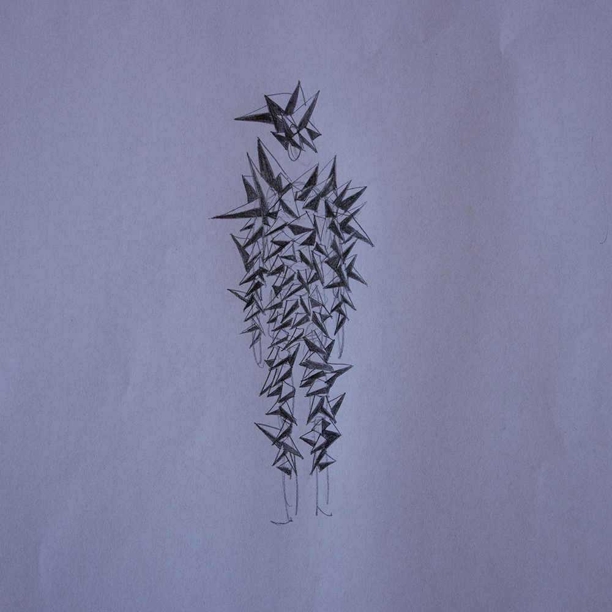

_by Béatrice_

### Graphic research part1

#### • Graphic research part #1

First sketches of the main character. The aim was to create an **expressive silhouette**. Our approach: drawing **simple shapes witch play with variations** like scale, orientation… Each kind of shape remind different worlds (vegetable, animal, rocky…) The result evokes kind of **strange sculptural imaginary characters**.

