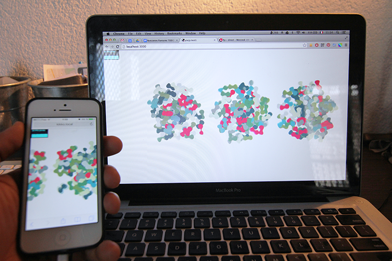

_by kikko_

### Very first tests

Beatrice has started working on some amazing art and concepts. So I had to keep up and start coding!

#### • Pixijs
The latest iteration of our idea is split in 2 parts.

- The interactive installation with body tracking interactions
- A mobile web app with touch interactions
Both of them are meant to show synchronized graphics based on both interactions.

So I quickly started wonder what kind of technology would be flexible and fast enough for what we want to do.
Ideally :

- the mobile app would run in the browser for accessibility concerns
- both ends would be able to share a big part of the codebase and graphics
- platforms would be as similar as possible.
- bonus: integration of some of our workflow's tools ([Spine](http://esotericsoftware.com/), [Texture Packer](http://www.codeandweb.com/texturepacker), [Particle Designer](http://71squared.com/particledesigner)..etc)

After some research and tests amongst various frameworks availabe (vanilla canvas/webgl, threejs, twojs, paperjs, pixijs..etc) I finally started coding with pixijs as it seemed to be a good match for my needs. And so far I'm very happy with what I see!

The test would consist in 3 blobs of about 175 particles each with induvidual tweening and filters. 10% of them would be an animated sequence of png.
So I made a very rough animation in flash that I exported as a retina and standard spritesheet thanks to the amazing [Texture Packer](http://www.codeandweb.com/texturepacker)

I made a very simple app based on the MovieClip example using my current favorite trio CoffeeScript/Jade/Stylus (you can check the sources on the [github repo](https://github.com/kikko/devart-template/tree/master/project_code/research/pixijs_test1))

There is no synchronisation yet, but it runs at 60 fps on my iphone 5 (with retina graphics) and on my early 2011 macbookpro!

You can try a live version [here](http://kikko.fr/lab/devart/tests/pixijs_test1)

So far so good, let's hope this continues :)