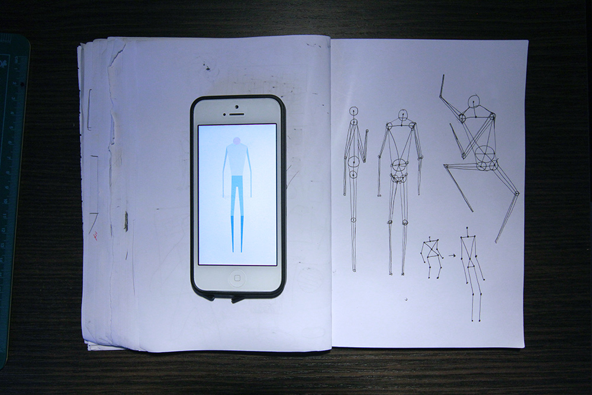

_by kikko_

### Skeleton tracking part #1 - Morphology Study

Our idea currently features a character that animates to match spectator's moves.
Beatrice has drawn a very nice minimalistic 2d character.

Technically, the greatest challenge will probably be to 'skin' a 2d character from a 2d projection of our 3d tracking datas. In other words, we have to find a technique that can dynamically morph a 2d character from face to profile while sticking to 2d drawing.

I have an (naive?) idea that just uses circles for the joints to ensure a minimum thickness, but not sure if that will work..

We should find out shortly :)