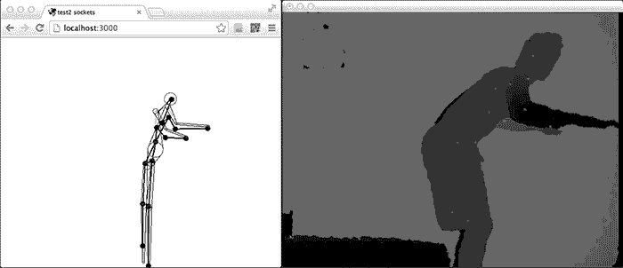
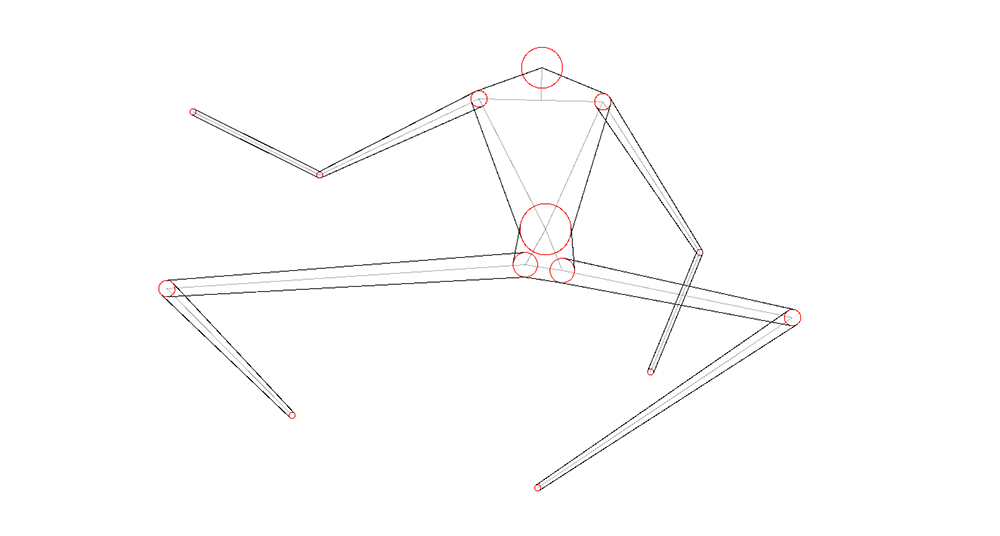

_by kikko_

### Skeleton tracking part #2 - ofxNi2 + ofxLibwebsockets = <3

Hey!

Finally started working with OpenFrameworks for the Skeleton Tracking.

I'm using the OF addon [ofxNi2 and ofxNiTE2](https://github.com/satoruhiga/ofxNI2) from Satoru Higa, that warps nicely the neat C++ API of [OpenNI2](http://openni.org/) and [NiTE2](http://www.openni.org/files/nite/).

Then datas are sent at super high speed thanks to the [libwebsocket](http://libwebsockets.org/trac/libwebsockets)'s fast binary transfers. [ofxLibWebsockets](https://github.com/labatrockwell/ofxLibwebsockets) provides a very nice OF addon with all the examples (c++ and javascript) needed to setup this binary communication very quickly.

Then I had to find a way to :

- morph the input skeleton to match Beatrice's character morphology. That was possible by setting a set of rules such as 'bring shoulders closer to the head level', 'lower the torso', 'brings hips toward each other'..etc. You can see the difference in the GIF above and in the source files of test 
- find out how to compute tangent lines between a point and a circle and between 2 circles as shown below (or the [live version](http://kikko.fr/lab/devart/tests/4_skinning))

The good thing is that the circles idea is working well for faking 3d positions of the body!

The only big problem now, is that pixi.js requires **a lot** of cpu power to draw antialiased dynamic graphics, with a bad effect on performances :( Hopefully I can find a better way to draw these shapes (svg, bmps..etc)