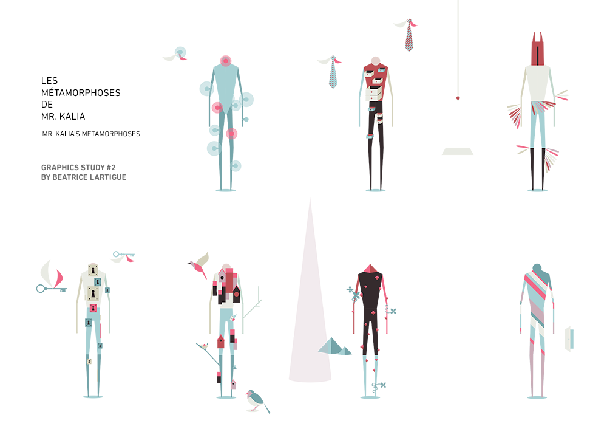
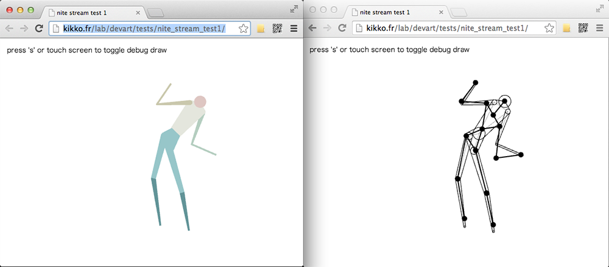

_by kikko_

### Week 3 summary

Hey all!

We've been unfortunately both very busy with our jobs and personnal lives but we still managed to make some progress for our DevArt project.

## The perceived redness of an evening sky

First, the project scope is becoming clear and we now have a name : ```Les métamorphoses de Mr. Kalia```

The name is in french because it's our native language, and it's close enough to the english translation "M. Kalia's metamorphoses" to be broadly understood.
This name has come up after lot of thoughts on what our project was about. The were 3 terms that we discussed a lot:

- **Qualia** - [Wikipedia](http://en.wikipedia.org/wiki/Qualia) - _“the pain of a headache, the taste of wine, or the perceived redness of an evening sky”_
- **Umwelt** - [Wikipedia](http://en.wikipedia.org/wiki/Umwelt) - _“usually translated as 'self-centered world'”_
- **Metamorphosis** [Wikipedia](http://en.wikipedia.org/wiki/Metamorphosis) - _“a conspicuous and relatively abrupt change in the animal's body structure”_

## Graphics & aesthetics progress

Beatrice has drawn some beautiful metamorphosis of our character :



We will detail later how these integrate in our interactive scenario :).

## Technical progress

I have started working with Google Compute Engine to see how hard it would be to setup a live stream of the skeleton data. Needless to say that with all the great techs available today, it was very easy!
Setting up an debian instance running node.js on Compute Engine was a piece of cake, following this [quickstart guide](https://developers.google.com/compute/docs/quickstart)

The only thing that annoys me is that since I'm using Socket.IO v0.9, datas are not sent as binary and are serialized. Despite that, datas are updated smoothly at ~30Hz over a 3G connection (latency is not a problem in our case). When I'll manage to transmit datas as binary (only 180 bytes per update : 15 joints * 3 axis * 4 bytes per float) it should run smoothly over Edge connection!

You can try the [live version here](http://kikko.fr/lab/devart/tests/nite_stream_test1/) on desktop or mobile (the server is reading data from a file)



## Sound progress

To provide an experience up to what we have in mind and heart, we have to start designing the music and sounds.
We're far from experts in this domain and we want to stick to the "solo or duo" competition rule.
We'll see what we can do :)