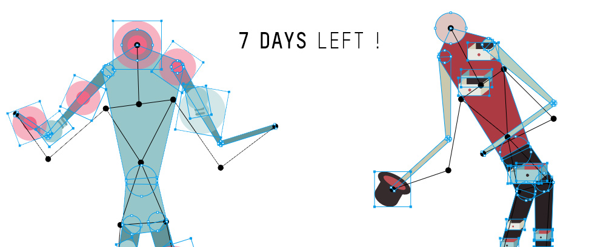

_by kikko_

Time to fill up our coffee mugs, we're approaching the deadline very quickly!
I'll try to sum up quickly what we've been up to with beatrice and why we've been so quiet lately.

### Living in a cage

Life has been tricky lately. We've faced a fair amount of very unfortunate personnal events and tough professional deadlines/issues, leading to more than 15 inactive days (sic!). It was hard not being able to work on our idea and see all the nice updates in other participant's projects..
But we are back on track for the last week! Epic circumstances allow for heroic actions ;)

### Doubts

Also, we had growing doubts about the similarities we found in our piece with the great [The Treachery of Sanctuary](http://milk.co/treachery) that was one of our inspiration, and is also one of the main installation of the [Digital Revolution exhibition](https://www.barbican.org.uk/bie/upcoming-digital-revolution)
Even though it's very different in what it tells, we couldn't help but worry that the jury might find its physical form too similar, to be an interesting curating choice.

So we tuned our proposition for the competition, and are now satisfied with the new form.

### Paper.js

On the tech side, we've switched our graphics library from pixijs to [paper.js](http://paperjs.org/).

Pixijs is great and proved to be highly performant with a familiar flash-like API. Yet as Béatrice kept working on the graphics, it was more and more difficult for me to justify using a bitmap-first library and not investigating further the capabilities of paper.js.
* The graphics style is very minimalistic, no texture, no background, no effects. Just plain simple geometric shapes.
* Béatrice works in Illustrator and SVG seems the best way of exchanging / loading graphics in our case. (small files + no pixel size/density restriction)
* The library provide some great geometry drawing tools out of the box

It took me a few hours to adapt the existing code to paperjs' API which is quite different from the flash/pixi/OpenFL API. And even if it was a bit late, I'm very happy to have made the switch!

To wrap it up quickly, we are now focusing on our competition application, getting a prototype ready for a quick video along with a precise scenario of the installation, descriptions..etc.

Stay tuned and good luck everyone!
