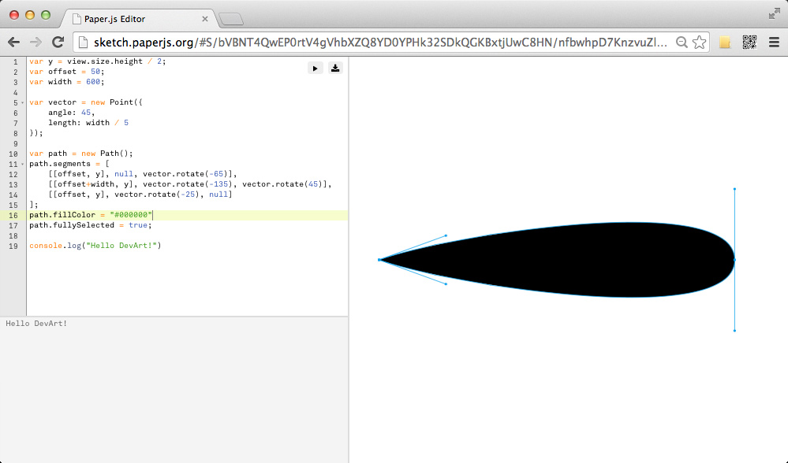
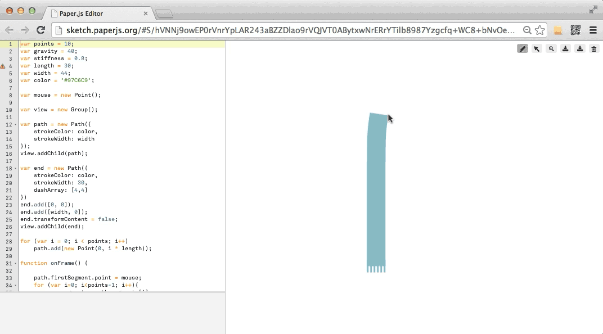
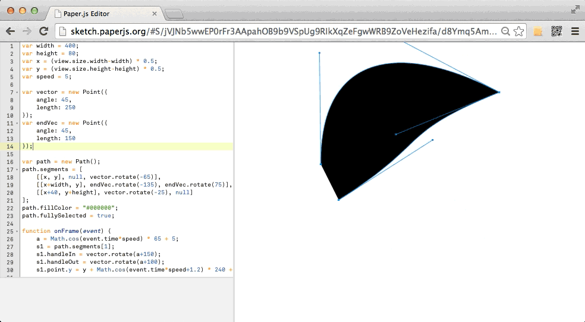
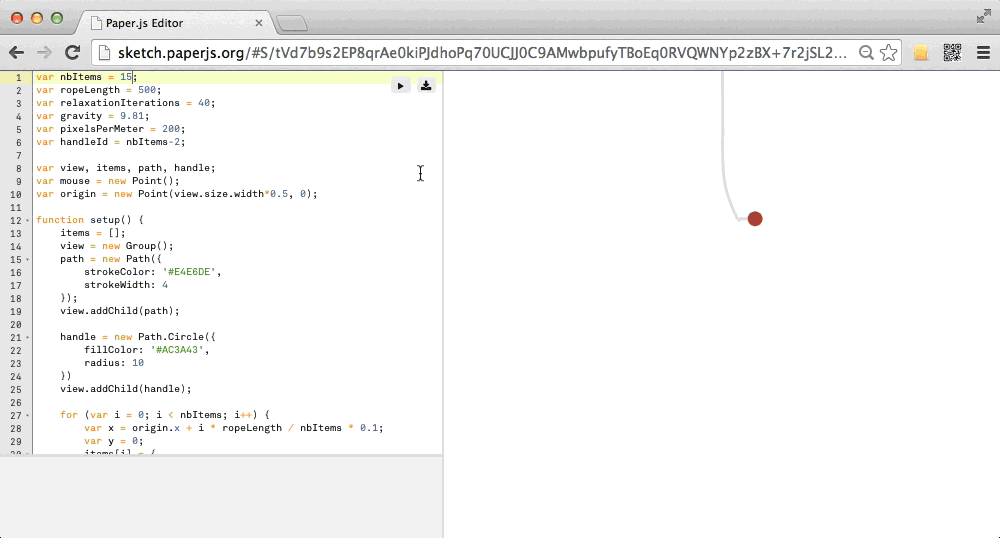

_by kikko_

In this late race towards completion of a prototype for the competition deadline, I've found a great ally : The [paper.js sketchpad](http://sketch.paperjs.org/).

It's "just" an online editor providing an interactive quick preview of the sketch. It's extremely easy to use, and you can use Paperscript (basically just a scoped javascript with operator overrides for mathematical operations on Points..etc)

I've been using it a lot the last few hours to implement some animated/interactive bits of our project. This allows me to prototype small parts on a clean sketch, that I then write back in coffescript in our application. That way I can concentrate on the code of the part and not worry about it's integration in the bigger app.
This workflow has proven to be very efficient and iterative since it's easy to share the sketch and get feedback. And most importantly, it's extremely fun!

Here are a couple sketchs I did, before importing the code in our application :

https://www.youtube.com/watch?v=AoRxW2XAXq8
_Kinetic minimalist tree_, [sketch](http://sketch.paperjs.org/#S/pVdbj+I2FP4rLpVWgYA3zHSkluw8dNhuVakjrUS1fZjpQ0gMWBNs5Jgw7Yr/3uNr7CRTrVQeIJybz+U75zhfJ6w4kslqsnkhsjxM5pOSV+p/Wwh0LF4fRMHKA2nQPVre5c9Mkykz5N8J28sDsO4yx3IanvVD5nh7wS+bEyEVUDOcOWuSHskDkRdCWHDYnVeD0z7SRgJnROxHEDJiW01c85oLoD9Pvn+4W/+yzp4necj/k1baqxuvJwUh82eG4LPt7D79lRvakZ8b8oXUvKTyb+X4HFWPA1og+5krfUYu6DOnTCZTpzBgGKWTIK3mx0zt3+7MSkk5Qw2R51MyRV+NjvLZiv8quOLkHQOfaMtlZA2cziIRCZE2Oy6Oa84kYUp6V9QNiczwhurDQ0stJRfc0H8IvqhMzjJ8N0cd8UDo/iAV1R1nvsH/3+Ag0RZ1AsZMAf+g5ct8rPxOt6gqQ9LxXaOMHIrmE3i5ORUlSQAdQs5R4RMEoSWquPQ+yxH94AqLa41KIKXp1Iqqj8YHxOnknqgrv+eua96QjQHvFusD8Z5Ih0zjwhR9+A+49kw20Hc/s32tKvlYyAMutk1SLLa4JSUuFEOZWwZadJcEfrx7F5jwkbuPAMQIFlVVfa7m0f5YISnOZJDgqEwd9OgOJb10qqC7QRF5ElfQUb+lOv14gtLgk8pWIwV/IaafZzCc8HI0zDiowB93gPlW7hRzZIEkBfXlUpx20JuOcyqEaR92ruvcpaifoSiaAdh08Xc1h6zoR6BX/JhMZ30rISj9wduAGBwy6rHmGGxpGHukjdrQWVDjLeBWvF8YFY6ojhu6Zw7IY7HcpEv4WtzmsXYBOrcZmnkTC/RTeN4VXQ60JolxJk1VR2QK+kHHtEG3oOn/CcUB2uXG/p2hXjAw31I141AvGg2fbkCgFLUjsfRD+W58lg0jsagm0NKh6+7U8Xnvsrzweb32gQ/d69d1f7enKApd5aK34xc9FXdwZ1W1JxQ2GUwOwAR6Hw2Pga6FFBAST5z3vYyXje5YUo4tWw94YBZ5R/N1Xw4sqWHjTMGj76VgCLlLR3AFGQq5m0dwDwmFYDLZHTJKVVAiZbTDgbcGPFWJkowz4NN8OjeHpA+VlR1zAT5USlYwAHuStgYr3xmBALizUl8BSTmy0t8RUQ2qlf0NGL6cq+7RAnS47jn7JGDZdWPbFjn/9n0ftszbyz7etth4PdxGuDwLsfHtbsQCYhoTvwDGGFy3ihpuSYkdDxa74YDot/bYWVp3uOti56P5ld5D52Gf5EXInM78tTwP1a3XfhSWNWckWiReJlgo5mnRuzXDzKDvb9Ob8dm8tfuc7I+QruYpgwWvelYb9KHnbyssRxV0CayH8eCLnVPJiW/0i0hATXs3FfwFv1NS/xaeoeZjhm/euEY7qRF0a1uPvCUJaT3awvcG0pog85AVvIM4Pn4Fd/w7BX510yR4ywhMjbrxkV9Y6IYOQ5AjeKcHDqDaA8F3WnOqKWwv2Dz9W4s7xr7DWMXJ9V8=)

The sketch's code is encoded directly in the url of the sketch.

_Mr. Kalia's scarf_, [sketch](http://sketch.paperjs.org/#S/hVNNj9owEP0rVnrYpLAR243aBZZDlao9rVQJVT0ABytxwNrERrYTilb8987Yzgcfq+WC8+bNvOeZ8VsgaMWCWbB8ZSbbBeMgkzl+N1SRveTCaLIgD5P5WiCyVbTh5ghQ0kLa8KIQTCNvEj95tGRia3YAPba8A88tkCQeyGQpFQB3n6bf0q/p9A5wF6lkrRlEBDuQ3+ghjLpYwwF0oV9K1vtBaE+tgM2CY/gGAaONkq8sRa2Zkxz38F/0NHPW1uKEpbB+TPM83fEyD7FkL8BEflGfwO+mQh/wGo8Tj+ZU774rRY8zskrGyQZ11wJKo2q4mozJZIOSHWLdDVGjqNCFVFUqhWHCgKeClppduQeyMw9kEuINOA5pDn/PfrhwHo0i7Ahe1Qr2XQcvnHz2s4x8qVpkhktBpPipYHXCiGCf2wIFV9os2bYCX7GVAEU7T8w2vZEF2nh2Ju4fnA07sLWxW+VKQLIt6z/1im/mPUmwf60WED0nRnRAalhm7J7pM1f3w2yHtUk2Ie422B188CopPpLRon0X75GQEl7qe2M3jETQ9O5Z2ZqnrsG6khJ2zw7Dvs2z/rhJ4JLspeZ2TnDxVdvmzeCiSFLSUE8Kr1jgrMO+eCyKqdiWDEJTfNeni414wUG/yIaFrGF4DzvR9jlbrHNwM/eHPIizXLvQRV2WxyUroWEMX6BRNXuvwp/9x/ntazkFp/8=)

_A bird's wing_, [sketch](http://sketch.paperjs.org/#S/jVJNb5wwEP0rFr3AApahOB9b9VSpUg9RIkXqZeFgwWRB9ZoVeHezifa/d8Ymq5AmUTkAM/Pe+M0bPwdGbSBYBvd/wNZtkAR131C8VwM7dI1t2XdWCPGtNJRpoVu3FlNXL5lHDMJ9Bwc+dk/AHSV174gtmOBywh3nON8o9Z85ctwCNIim2Gf2UNt+wJSBA7vrO2PDZ6xZZdYalqyQCUUazNq2S5ZLUZpTNHUD0/yG+n+52Znr2VvlDHBc/A2pQjk+wnoDxo5YXFGD1eoxYccqYWandTIp5kNvlYUwvZBRlUyw2JnjwV7cGZZ9ldHb5OVraiGQF3vTqn9OyYlN51elqV6EPnRa/+i1s68Mvgj3lMG5jPDjPWjs5Ey3ww7c9A87U9uuN6w3Pwe8IiHscd6IoXkMH4XYG2pQ96MvcdttYOGWR/u8kCx2KyT0mCF85tsqq8413irTaPhlEDQfScW4kOgt8HZn30OK18gtbZrTpTuijg+VxhnPSW1eCJIr3OhuvvyzAdNLIknBUpaJ6dD5eKL6RGyq8kXGZXoto3fJefWxJZ6bp4XjnoLTXw==)

_The light switch_, [sketch](http://sketch.paperjs.org/#S/tVd7b9s2EP8qrAe0kiPJdhoPq70UCJJ0C9AMwbpufyTBoEq0RVQWNYp2zBX+7r2jSL2TrBtmILF0d7zH7x48fxll4YaOFqMPn6mMkpE3iniM77tQkOzTlaSbgpyS2Xx5lyFJ8Jy+p9laJkCdT6eWTNNwH0rGMzgh9AMeO7H8tQh3TCogvQl+mBlizvY0LW6ouKZwCHjHlb4kzOKUXsVANE74x8AqmTtGHzzCkOqRPJSJZ+TN4Q3fFhRP0gdyw1kmHddwuGBrlrVYqCwo2N80eGCxTMbTYO6RqauNrbZZhKGQgspt7rjky11G4MMMKrf3y5KASozWnwRHUcNA76w5eHSMAvwUUvDP9JynXCzIq+8uTy6/v7h85XUF/kCvFuSkpB/chsUgjOPzhKWxg2Ysp/xfAtIwHZwzEaW06cGKpWll/+z89dnJ66Z9EcZsWyzIbGptD5kuDbWNr7ggDuLNwIHpEr5+tGmEl6OjCkitDuT2IFfmJtiTI5AfNwttUhXimEyD2bJ9VmkbNU0n55bdA7lhBT/7Bdl7bZJaENUh5YLu/hwQ1fQBeVbcsCyj8YKswrSgNfPQcAoThJg5deHtPaJci9uhUVi30/vAKoUgpNhiYR9aBbnN41BSJ6apDCs0TXoQd9BTdekQkstalqZpmBc0/o1tsF60Sl39KFDa+Vnn2HEr8mRCzvI8VWRHRUolgXjoumz7IVc8A6r5VstemUBT6thblYEU8MgmtAmnVmd4wb7LUZajmnWxIs4LTbXgut0CyRNVsCjQoX3MmAyF+l0HeFXH55QBNVHz7HjzOiPNbZg/tOMKqhDKh+UQW1m2apdJJwn18O2Cj4cZTEMPxsBe9mCXpj0l9OfQBEdWp1ufy9nTefuHebBijLyFUTzEtanG4GpTxCezrrkncnvBChlmEf21Ct2pq7WErW4kd0DvoU06DGb7mxGzww6Cgb//Dz8siQGjPYP/BkHU/Z/ROwxPPTuNbFyIbUHXG5phOHrSmtfi1u4RGNOd1C0BMoYd5DiIjWc4avXiEKyptHE5uXUc4YyhTWbzae/2itlqBacdfdzP3U4vN7zA2+1Uywd72DTePCGpKknVkOxBEovwoYbiuVqzA/mRqdqCjt2X+ATDc3ZYtjd5D/UeFBQbzmEHGlpU4HjBdECPZrDKlgbgLoPx5z/2aUHEs3cCdlyH7kBhBYe5QTUxKO9RWwka0t6Vy7NrzO813zVV3cn+tlnq1O4+quaCP2QtNXqrWm3TVH2gKY3k43e/0fAxf/683kisAgAskTJfTCZREopU+YXcxowHEd9MPqV8PUnkJp37uC74BdtsU93QfnnF+40r3oeU+PV9MTHbvB4P9db15C0Ky5IN55su1O56oIvzGPZC8+I3L9clXpG/cBJGEUBSGiYJFbSjQzV1qJYO6MLqt8u4vSr1Xtuu2vr3+mj0p2YfjpXg8B+kYRpBLs0U7U2eujfBbTzTalItUrekFVFdkUK+AzrIXevW+0tIBzSPUf0RKoAn1ZpqOAzNobddJ8nLl5XGF6cD94/197RW4vcjHRP0YWJVuXr3n3fvQhPX86rUU6o69435tbccHb4C)