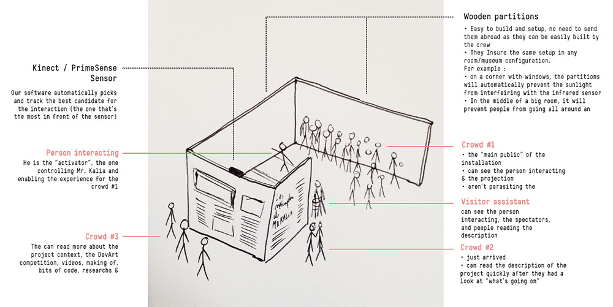
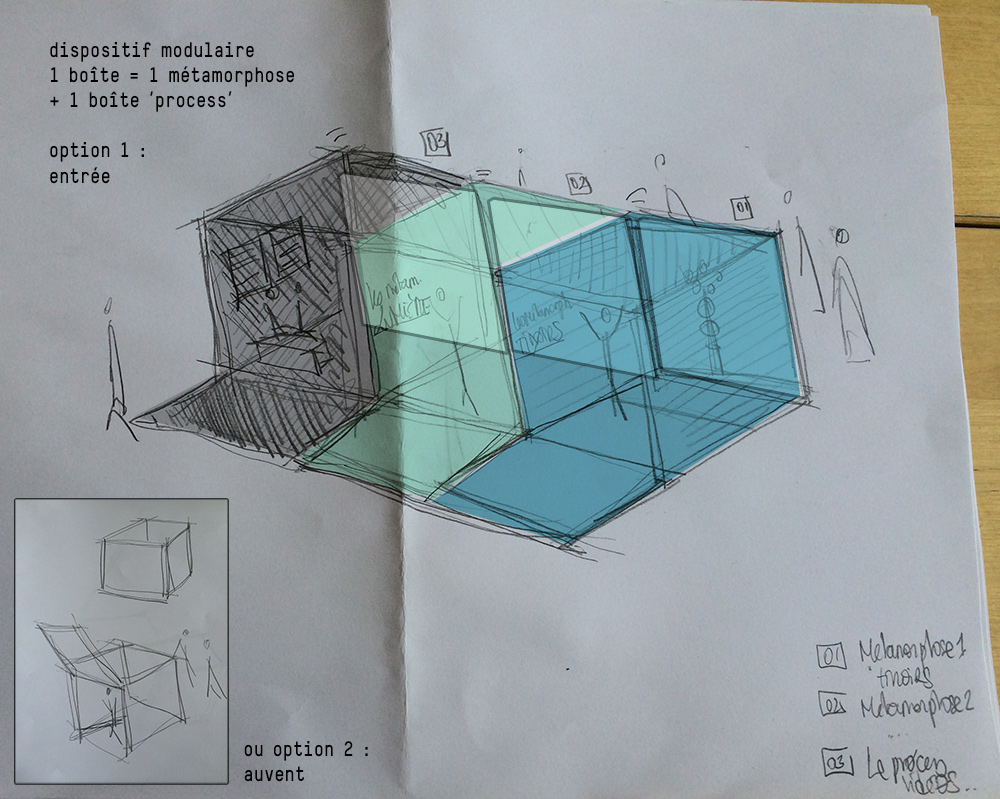
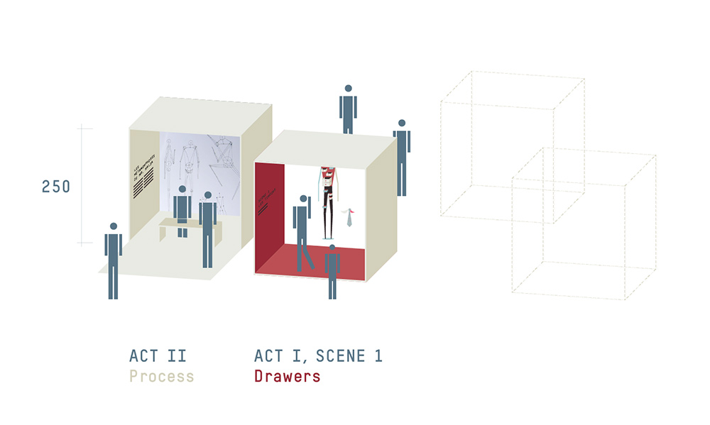
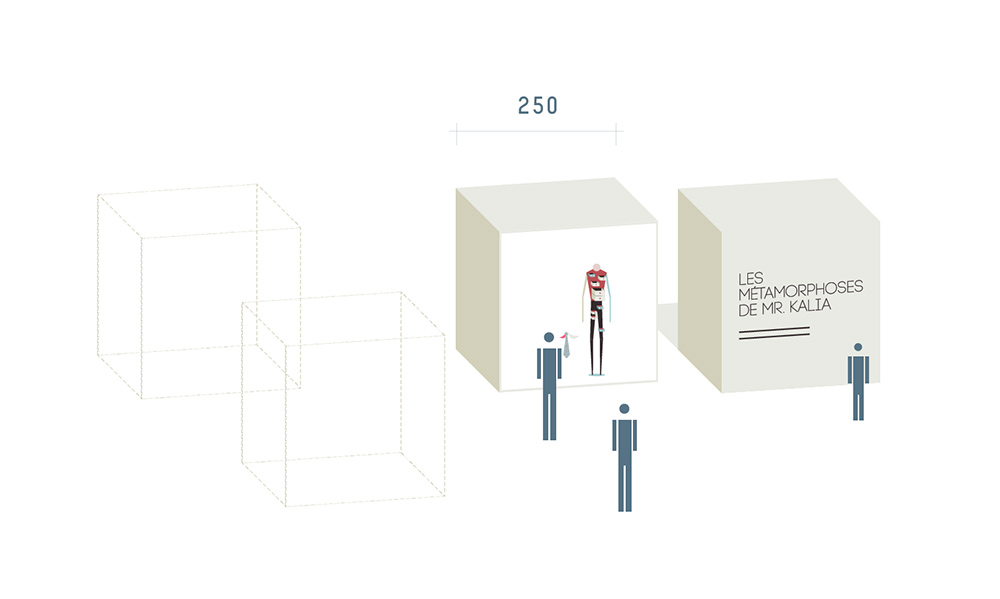
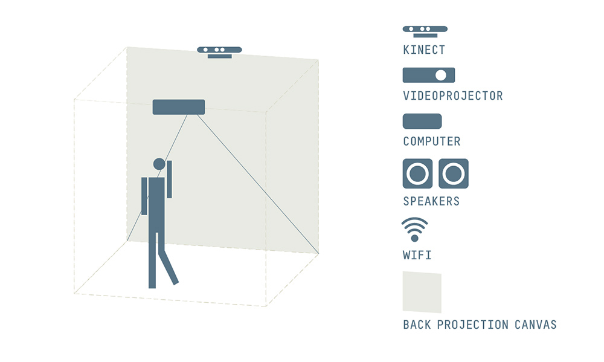
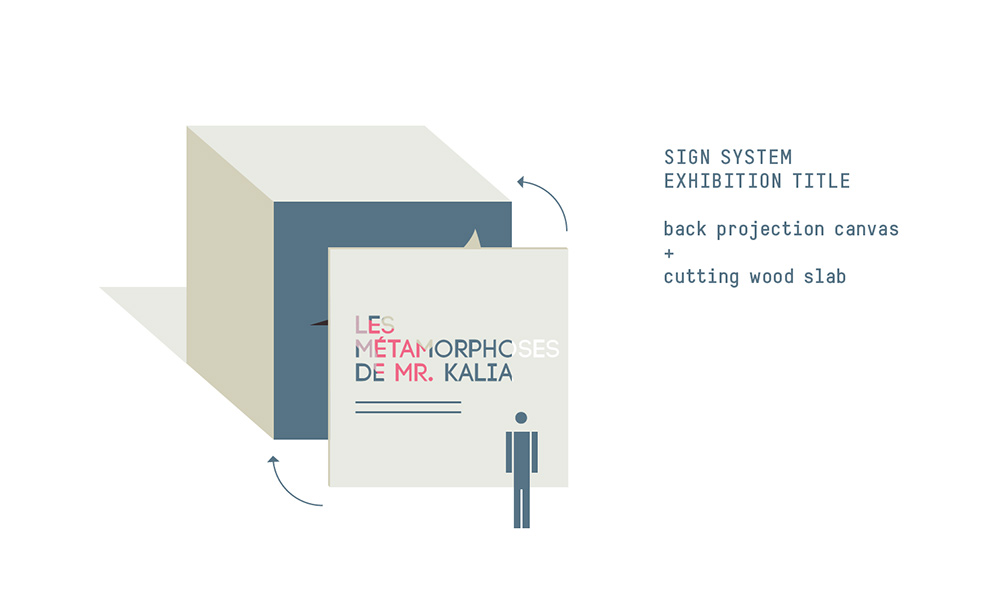

_by kikko_

As mentionned earlier, we've decided to update our exhibition space idea. A few key points for us were :

- **Concept** : The physical aspect of the installation has to reflect its content and meaning.
- **Public access** : The space has to take into account that the person interacting is **not** the principal public of our installation. It's an activator, an actor, but not necessarily the main spectator.
We estimate that about 20% of the visitors will actually interact with the installation, and we want to make sure that the other 80% are in conditions to enjoy the experience completely.
- **Optimal for the sensor** : Using an infrared-based sensor is renowned to be unstable in some conditions (mainly sun-lit places) and the exhibition space design has to prevent technical issues that could arise from changing environment.
- **Cost** is a concern since if we don't win, our budget will be far less than £25k, even over 2 years. And now we really want to show this piece no matter what :)
- **Mobility** : If we win, the installation might travel around the world for 2 years after the Barbican exhibition. So, as much as possible, it has to be easy to dismantle, transport and rebuilt, or easily rebuilt from scratch by the local technical crews.

### Sketches

A first, very basic iteration I did looked like that :

Technically, it was a good fit but it was too functional and would not scale up very well (hard to duplicate in the same space)

Béatrice took a different approach :

### The ideal setup

Based on the later and after a few discussions, Beatrice made the schematics of the ideal setup.

The key idea here is that this setup allows everyone in **front** of the box to see the result of the metamorphosis happening **inside** the box. That's very interesting both technically **and** conceptually.

Dashed boxes show how we could scale up the installation to multiple installation boxes.

A wide-angle video-projector will prevent the user from creating shadows on the projection canvas.

