_by kikko_

This is an archive of our project description as it was before the competition deadline. We will be updating it a lot in the coming weeks and we'd like to keep a snaptshot of it :)

### • Space setup and suggested scenography

#### Front view :
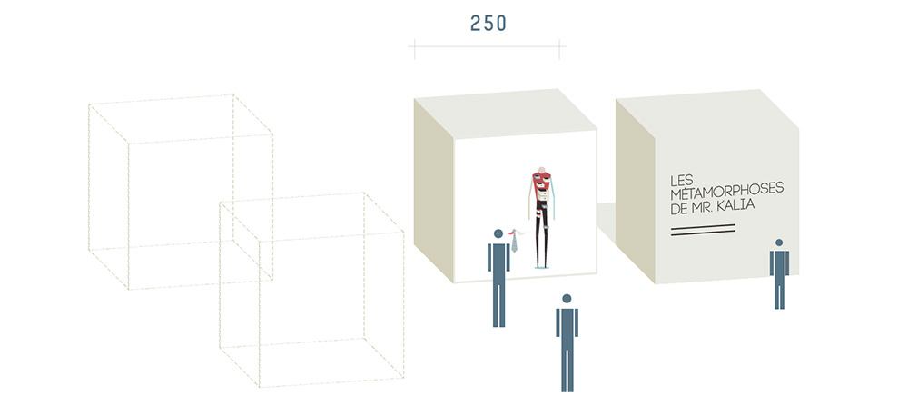
#### Rear view :
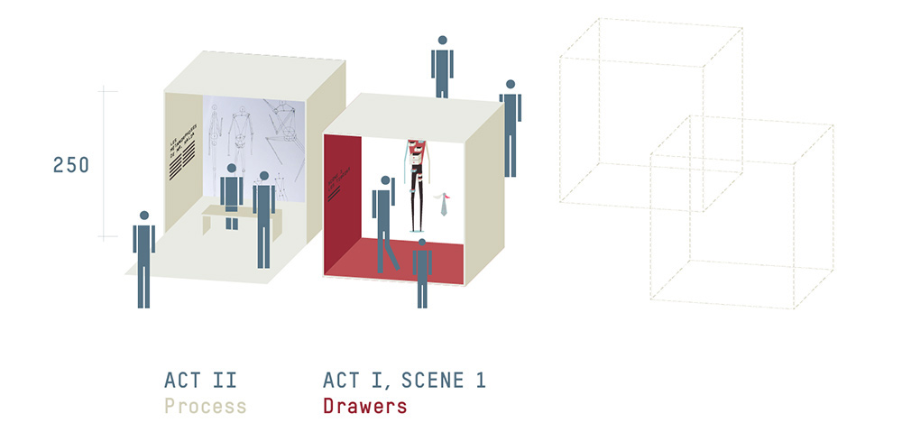

### • Scenario

Staged as a theatre scenes, M. Kalia metamorphoses follow each other through distinct scenes.
Each of them is followed by a short pause anouncing the upcoming scene name and context.

In the final piece, we would like to include about 20 different scenes that would all treat different aspects and different kinds of metamorphoses. Due to the context of the competition, we concentrated our efforts on prototyping only 7 of them.

#### → Scene flow

The scenes follow each other that way :

- Screen 1 : Act number and scene number displayed over a colored background
- Screen 2 : Scene name and a short phrase providing the context
- Screen 3 : curtain opens with Mr. Kalia on stage
- Screen 4 : [Scene content]
- Screen 5 : Scene end reached, curtain closes

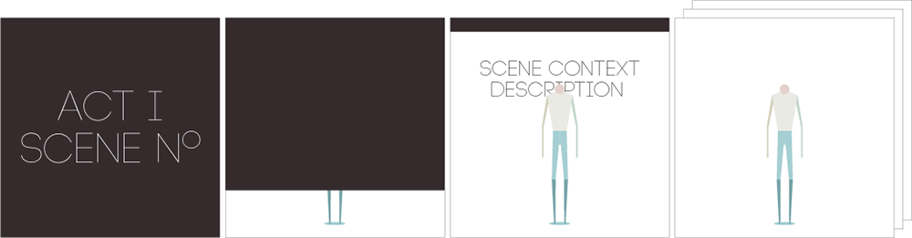

Each metamorphosis is displayed as a painting, without camera movement, making M. Kalia part of the screening environement. It puts him in the room, among the audience.

**Word of caution** the following storyboards are not final and are simply made as a stamp of our progress for the judging process. Please consider them as sketches of each of the scenes presented.

#### → Scene 1 : Drawers
_"Mr Kalia is here. But he needs to go to work."_
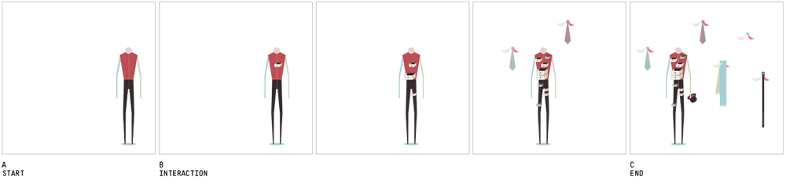
In this scene, Mr. Kalia sees drawers slowly appearing over his body and opening to let everyday's life clothes and accessory fly around, play with him like naughty kids and give him a hard time to be caught back. Mr. Kalia can catch the flying items and put them back in the drawers.

**keywords :** social adaptation, personality drawers, routine

#### → Scene  : Stripes
_"Mr Kalia is out of his room. The sun shines."_
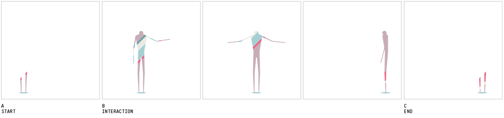
In this scene, Mr. Kalia seems invisible at the start. After a moment, we can distinguish his foot, and then his knees as a few stripes seemed to reveal them. As time goes and Mr Kalia moves around, his colorful silhouette becomes visible.

**keywords :** reaction, immersion, camouflage

#### → Scene  : Bulbs
_"Mr Kalia shares his body with a few handy items."_
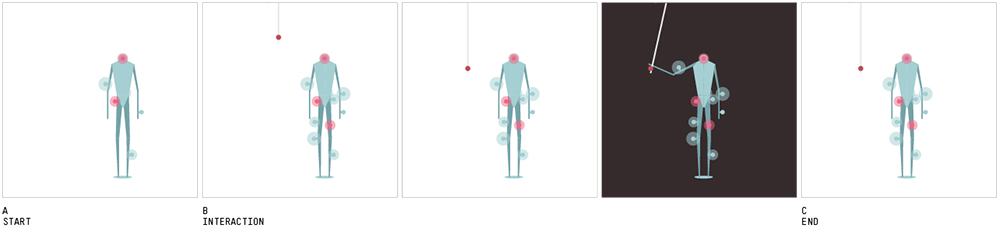
In this scene, Mr. Kalia wears many light bulbs, forming an excentric costume. However, as he pulls the cord and the whole scene turns dark, his body shines beautifuly from the bulbs.

**keywords :** wearable devices, cyborg, body's technological upgrade

#### → Scene  : Thorns
_"Mr Kalia pierced his body to make it his own."_
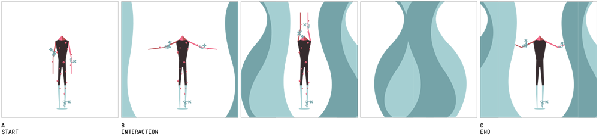
In this scene, Mr. Kalia is covered with thorns and flowers that look good but seem quite unconfortable. His hands control a waterfall that washes the thorns from his body.

**keywords :** expressive metamorphosis, tattoos, piercings

#### → Scene  : Tribal
_"Mr Kalia dreams he is being an eagle."_
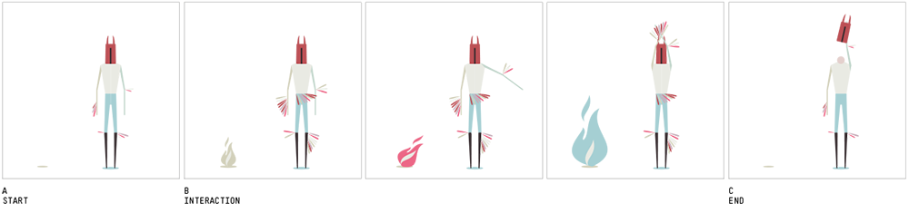
In this scene, Mr. Kalia controls a fire as his body moves around in a tribal dance. Everything fades away as he removes his mask.

**keywords :** fantasy, ceremony, costume

#### → Scene  : Lockers
_"Mr Kalia has heavy lockers attached to his body."_
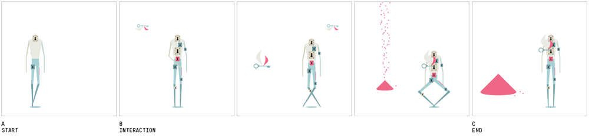
In this scene, Mr. Kalia carries some big lockers that make it hard for him to do any move. As a few keys open the lockers, sand falls from the sky forming a big pile, and lockers get detached from the body.

**keywords :** secrets, revealing, releasing

#### → Scene  : Tree
_"Mr Kalia has been around for a very long time."_
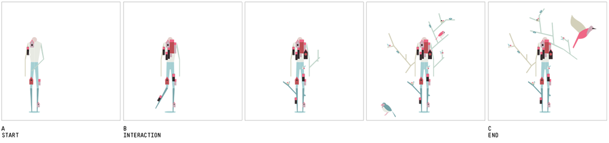
In this scene, Mr. Kalia's body slowly grows branches, leaves, nests and even birds houses. After a while, birds start making his body their home.

**keywords :** evolution, symbiosis, nature

### Design

Inside each scene, the metamorphosis is depicted through 4 elements :

- The body elements
- The scenery
- The interactions
- The music

The overall aesthetics is minimalistic. Mr Kalia's silhouette is simple and slender. It can adapt to many different morphological changes and 'body upgrades'

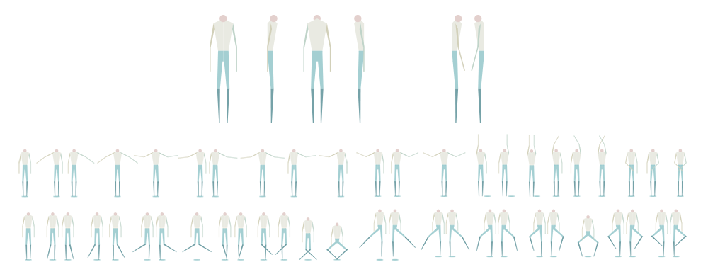

### Technical setup:
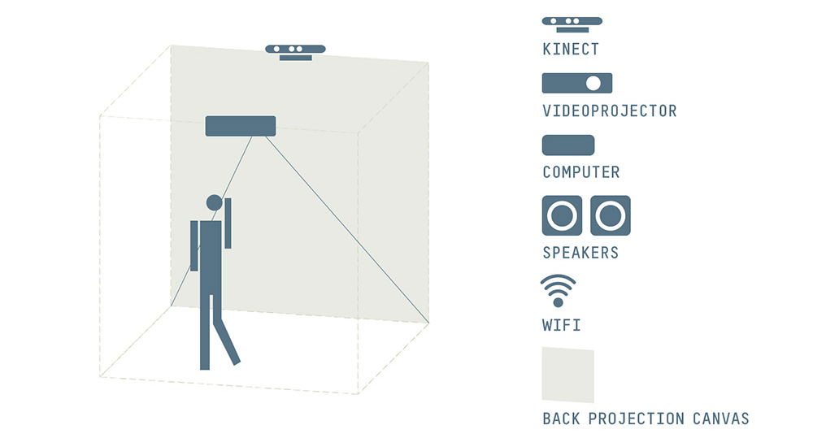

A wide-angle video-projector will prevent the user from creating shadows on the projection canvas.

The animation is projected using Google Chrome in presentation mode. Because of the vector graphic library we use, **the application can adapt to any resolution and pixel density**.

The experience is also be accessible **live** from the browser, and because only tracking datas are streamed, people with relatively slow connection (edge/3g) can access it as well.

## Link to prototype

To give everyone access to the prototype, we've recorded some very basic body gestures that we stream through our Google Compute Engine.

- You can access the non-interactive demo here : [Mr. Kalia prototype - stream](http://kikko.fr/lab/devart/wip)
- The code of this application is available on the [github repository](https://github.com/kikko/devart-template/tree/master/project_code/prod)
- If you want to try the interactive version, the [skeleton tracking application](https://github.com/kikko/devart-template/tree/master/project_code/prod/installation/NiTE2-userTracking) is also available (OSX only for now).

## Next steps

- The immediate next step would be to finish the existing scenes, adding more interactions, items and bring in new scenes in order to reach ~20 scenes.
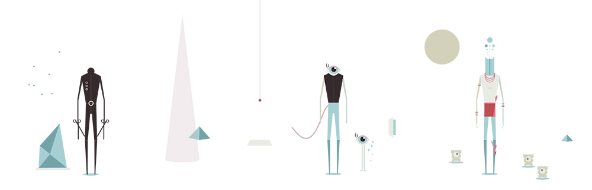
- Welcome a musician / sound designer in the team to work actively on the sound design of the piece. We expect to eventually adapt some aspect of the project to match the sound designer's work.
- Explore the remote interaction possibilities offered by the live streaming, accessible anywhere from a simple web browser. Scalability of the concept, is what has prevented us from including it so far.
