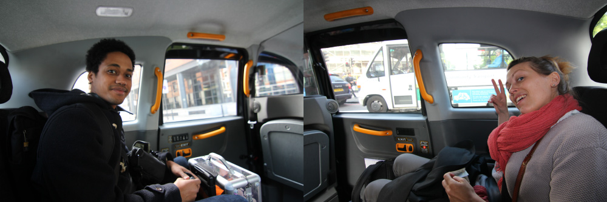
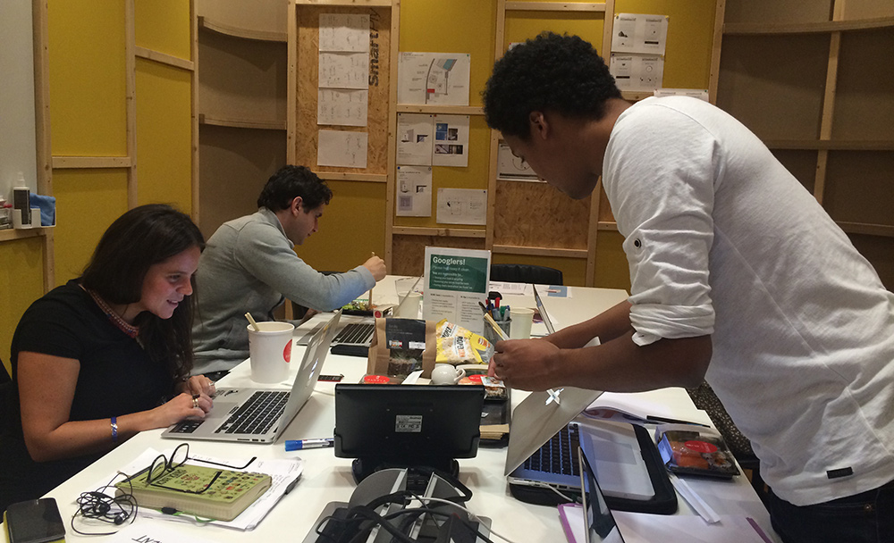
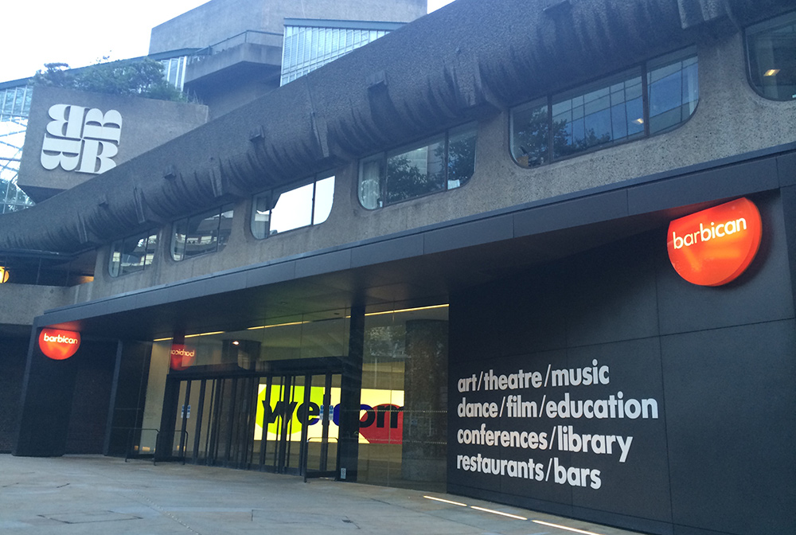
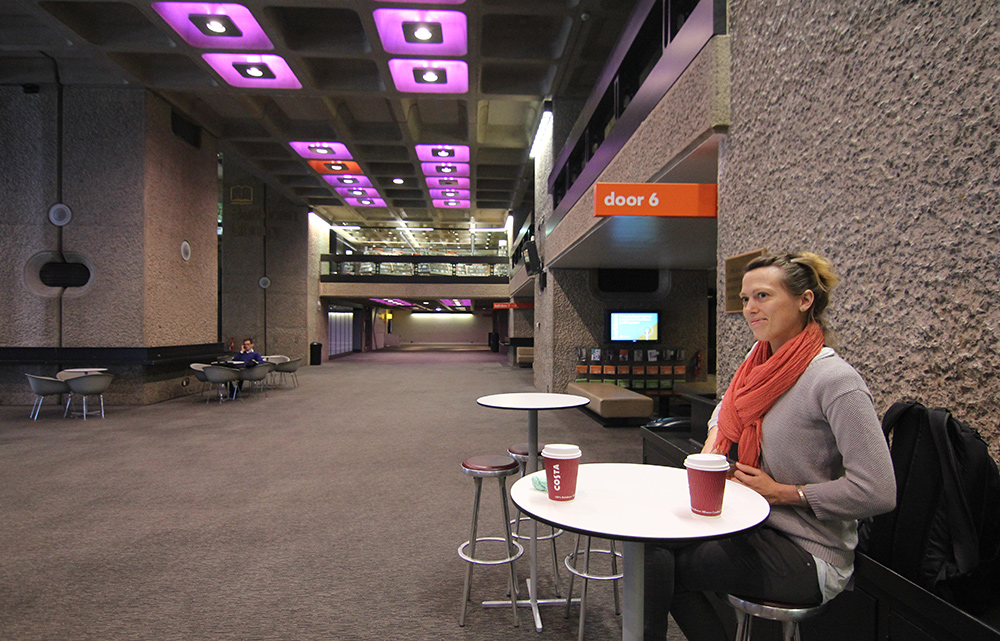
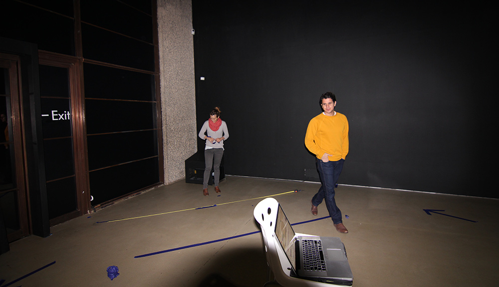
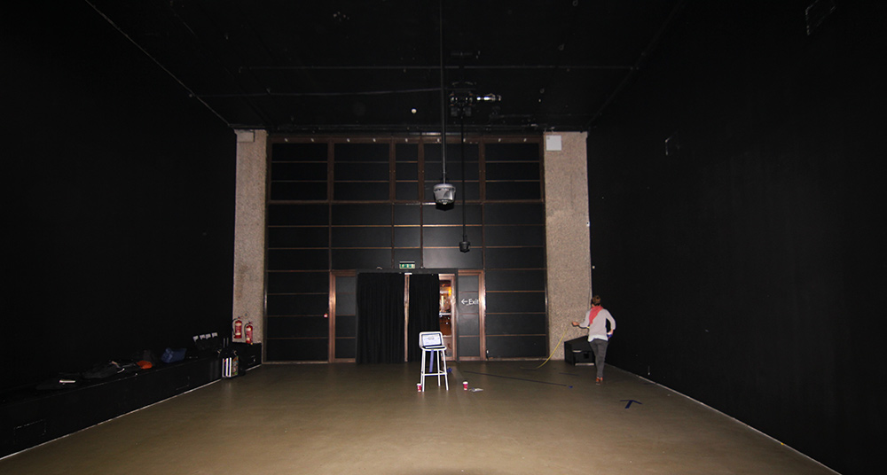
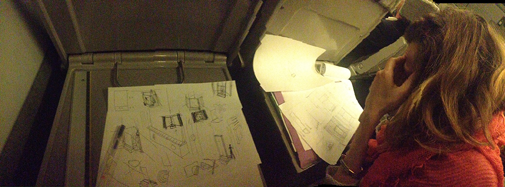

_by kikko_

Hi everyone !

What a ride this has been! Since the announcement on the 17th of April, we've been on a rollercoaster!

After a few inspiring hangouts with the DevArt team, we thought it would be great to meet in person. We would be able to work together for a day to explore ways of improving our project and visit our exhibition space at the Barbican Centre.

_Béatrice (right) and Cyril (left) in one of the famous london cab_

### IRL work session @ Google UK

Going from a competition prototype to an actual 1000 people/day exhibition is a great challenge. Thankfully, we met many people from Google and the Barbican to help us work out some tough technical challenges.

_Reviewing the project with Emma, David and Olaya (not in the picture)_

### Barbican Center visit

To get a better idea of the space the work will live in, we visited the Barbican Centre. We had the chance to experience the great [Momentum](http://uva.co.uk/) piece from UVA.

_One entrance of the Barbican_

_The Barbican has many nice spots to work or take a break_

The day after, we had access to a lit curve gallery and got an idea of the unusual proportions of the space (6m high ceiling!). We also had a great discussion about the technical setup with the Barbican team.

_Béatrice and David putting down colored tape to review our setup proportions_

_Global view of the DevArt exhibition space_

### Lot of work to do!

_Béatrice thinking of ways to solve some space constraints (access norms, sensor distance, shadowing..etc) on the train back to Paris_

During these 2 days, many questions where answered but many new questions where asked. There is still a lot of work to do, and much more that what's been done already.

But we're so enthusiastic to see the final project being experienced by the visitors :)