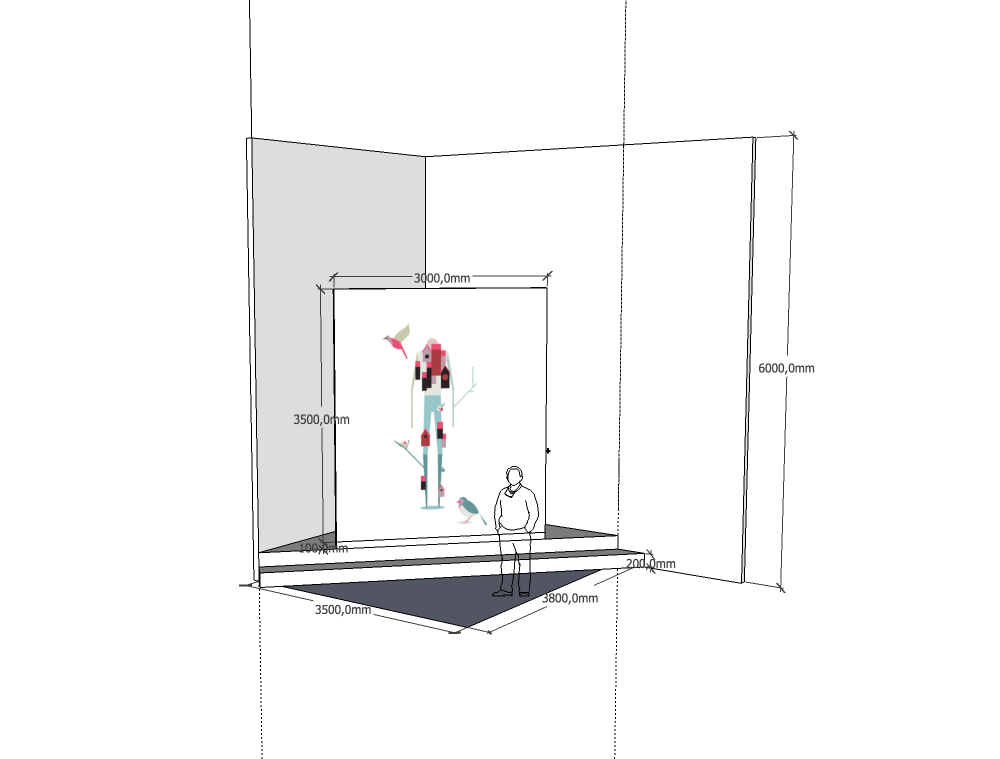
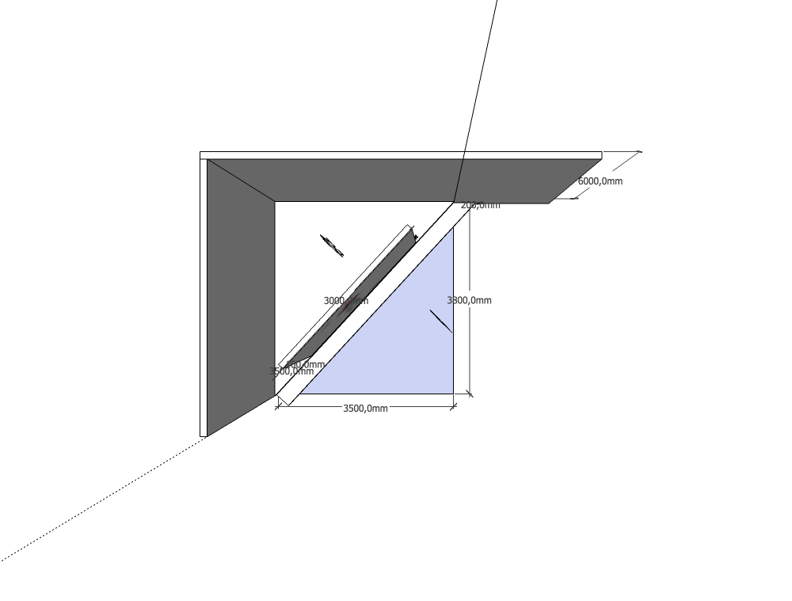
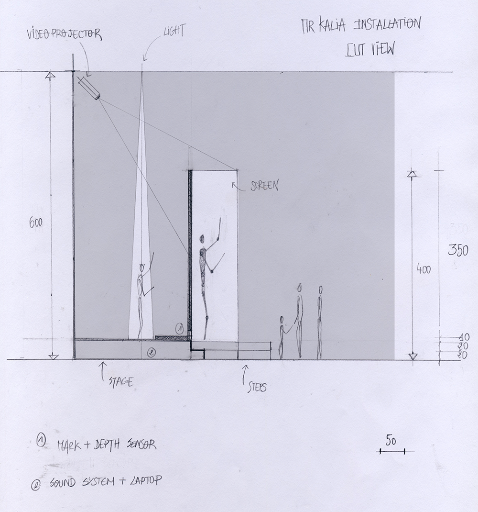
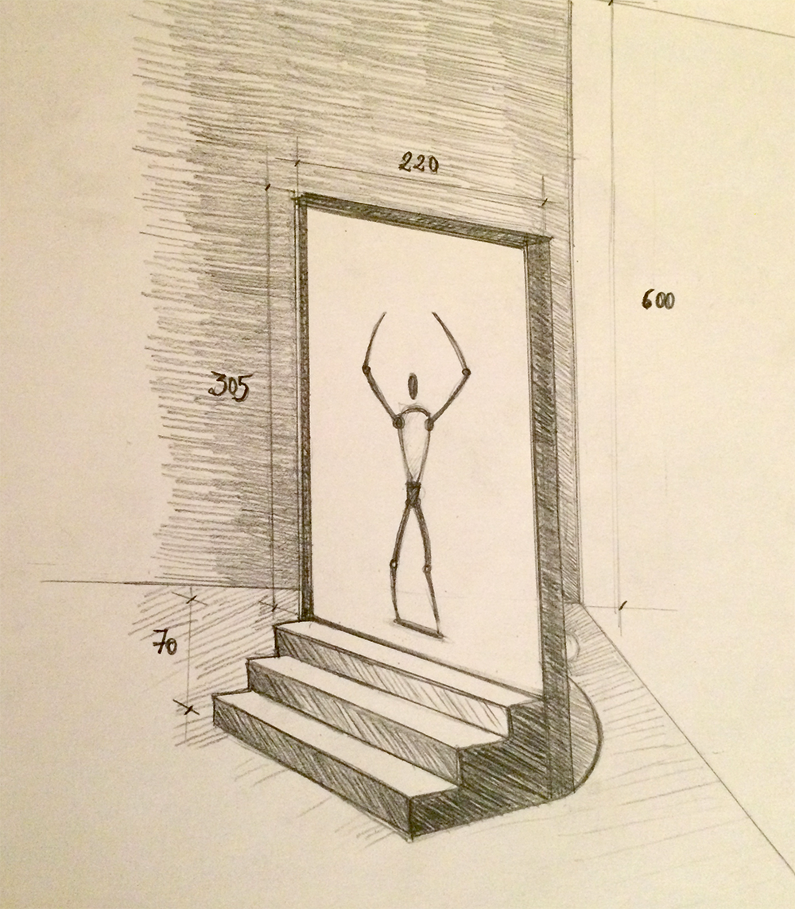
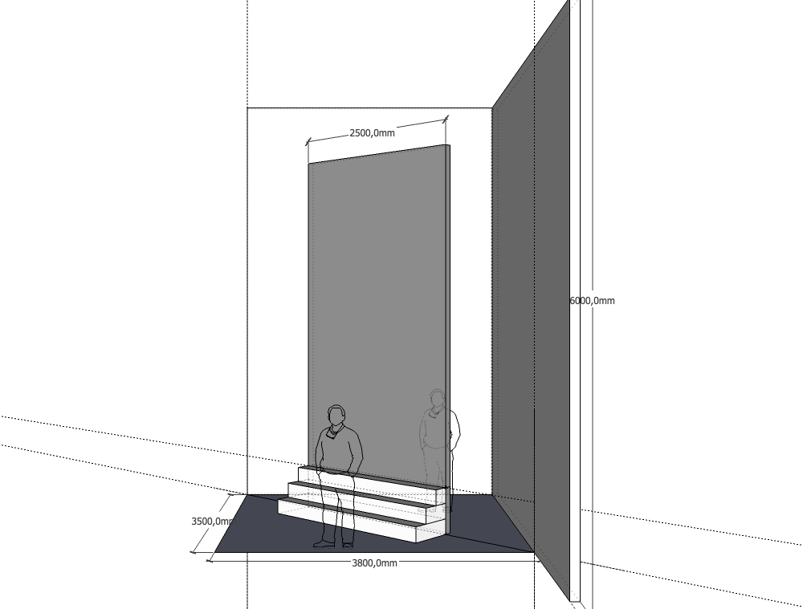
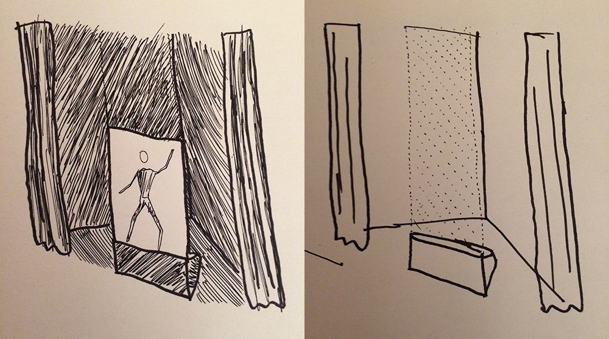

_by Béatrice_

### Set-up sketches

**A/ 'Steps' set-up** 

To emphasis performer interaction, we turned towards 'stage' idea.

_perspective view_

_ground view_

_cut view_

Then we tried to improve this idea, to let all visitors access behind the screen (accessibility for persons with reduced mobility…).

_perspective view_

_perspective view_

**B/ 'Monumental' set-up** 

To make set-up fit with the Barbican Center high ceiling, we tried to think in a more 'monumental' way. Using a material like 'gauze' lets screen disappear when light is on.

_perspective view: light off and light on_

