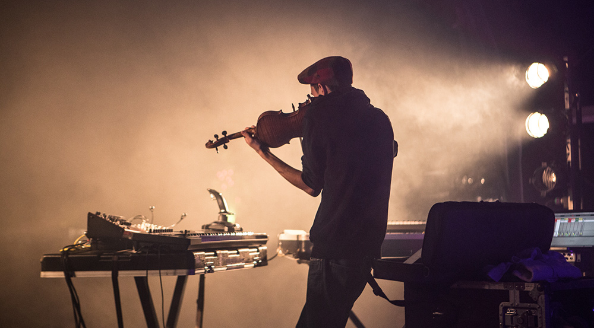

_by kikko_

We're delighted to make this official !

Louis Warynski, aka **[Le Chapelier Fou](http://www.icidailleurs.com/chapelier-fou)**, is currently composing the soundtrack of _Les métamorphoses de Mr Kalia_ !

_Chapelier Fou @ Eurockeennes 2013 - photo by Vincent Tournaud_

We've been fans of his music for a long time, listening to his albums for countless hours at the studio and were psyched to discover his enthusiasm on the project.

He's been composing some great tracks for some metamorphoses already that we can't wait to share with you!
Here is a preview of the track he composed for the drawers scene :
https://www.youtube.com/watch?v=RznL0vluuV8