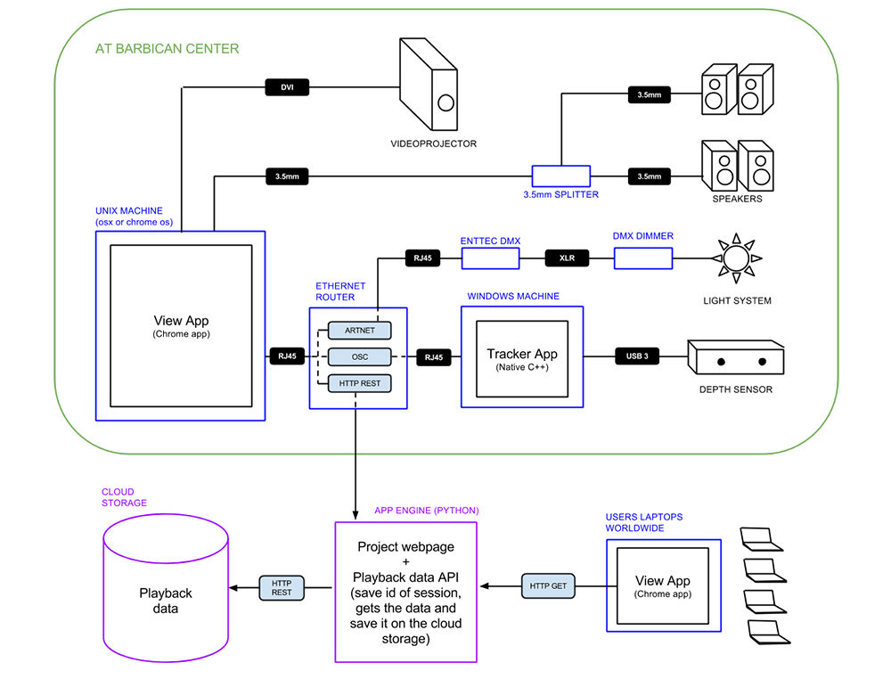

_by kikko_

To be able to validate some technical aspects and coordinate the different teams involved in our project (DevArt, Barbican, light and sound production teams, network team..etc) we had to quickly put together a new technical schematic of our setup.

So far we have 5 different group of elements our computing system has to interact with :

* The depth sensor to retrieve the user's body position
* The video projector to show Mr Kalia's animations
* The light system to automate the flow of users (1 user at a time)
* The sound system
* The distant server to store and manage each recorded scenes data

We're still discussing this architecture wit the different teams, and it might change over the next days but for now we're quite happy with it!

Big props to [Paul Kinlan](http://paul.kinlan.me/) for all his insights and help putting this together.

