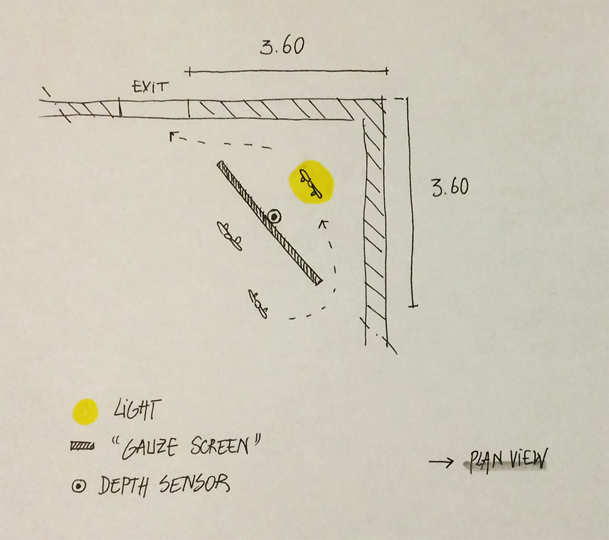

_by Béatrice_

We had thinking about user journey, and how set-up (throught light, music and videoprojection) could help us to enhance :

* user flow (with around 1000 visitors per day at Barbican Center)
* interactive experience (for both performer and audience).

_ground view_

_perspective view_

