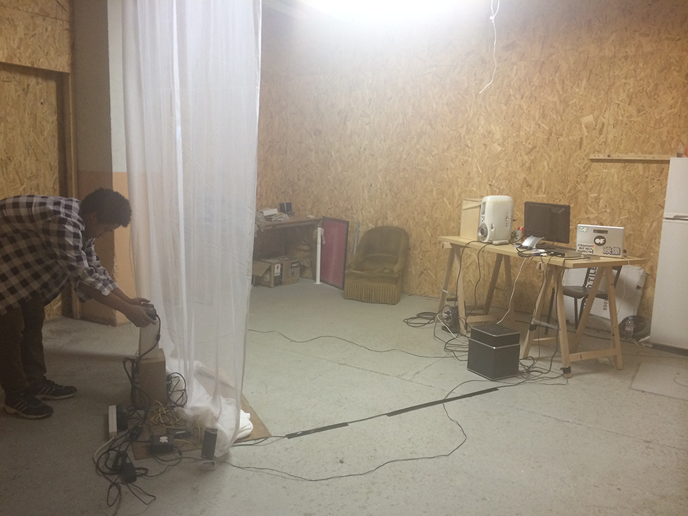

_by Béatrice_

We've made an home-made set-up in our atelier, in order to test it in as 'real conditions' as possible (with of course reduced set-up scale and home technical material). It lets us made user tests to approve or adjust if needed user flow and global user experience.

_Cyril putting set-up in place_

_Working session with Olaya and David_

_Cyril enjoying coding_

_Lighted view of set-up_

_Dark view of set-up_

