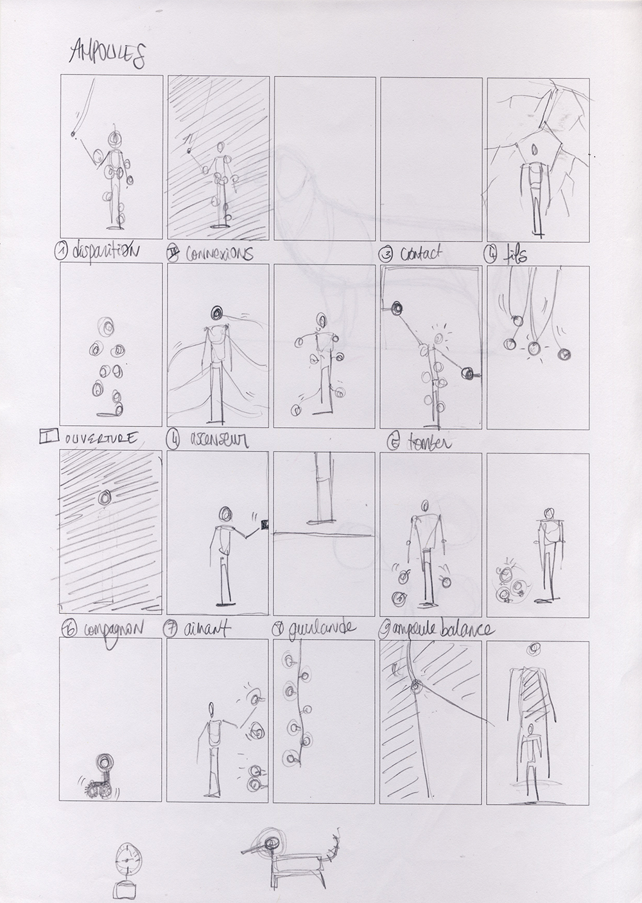
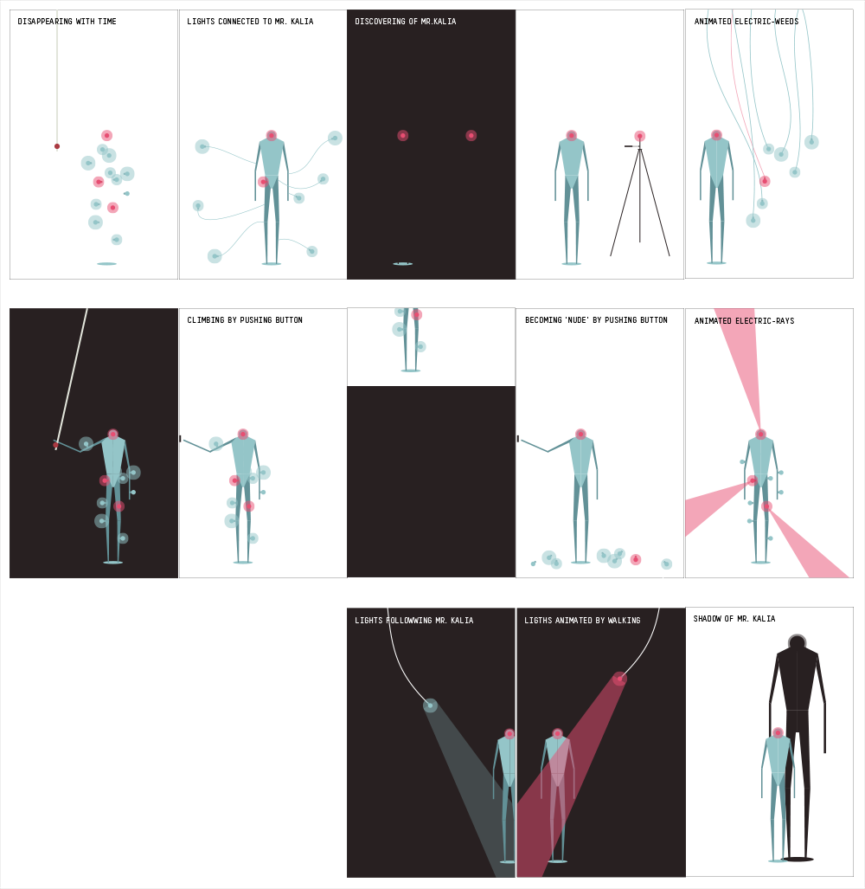
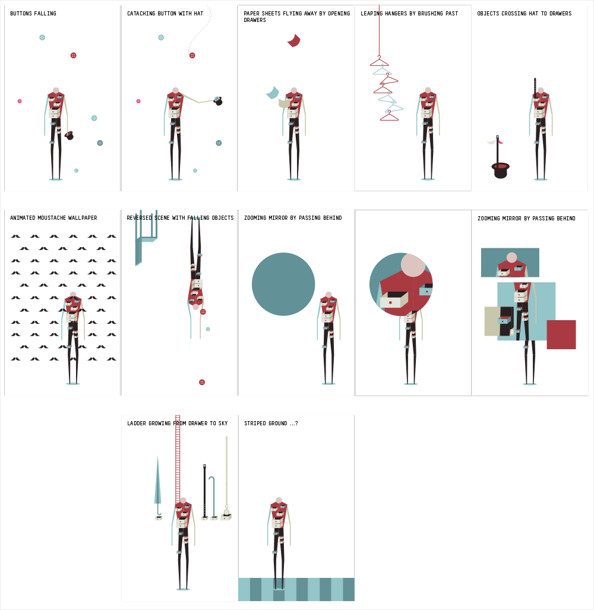

_by Béatrice_

We wanted to enhance narration through new interactions. For example in 'Bulbs' and 'Drawers', we thought about interactions around Mr. Kalia metomorphosis in correlation with the music of each scene.

_Bulbs storyboard sketches_

_Bulbs storyboard illustration_

_Drawers storyboard illustration_

