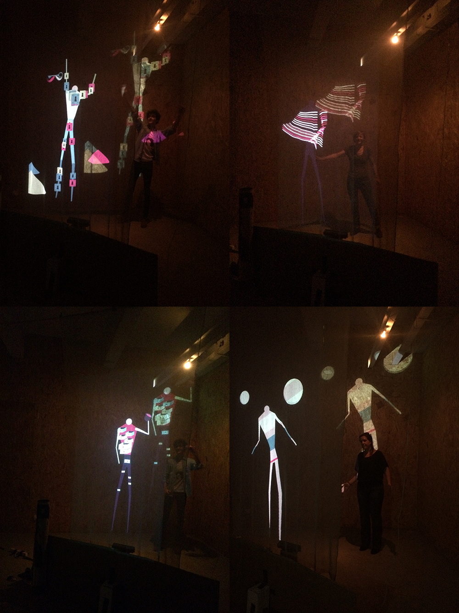

_by Béatrice_

As initially planned, we made user tests on our installation. We tested the scenes and all the user journey: everything worked well! However, we noticed few points to improve like: transition between scenes to drive smoother (light fade-in), end of scenes to cut a little earlier or few key-time events to refined. But overall, it worked great! 

We also asked testers what was their favourite scene, the one they found longer and why, in order to try to improve it in the last few days. 

_User tests session — Many thanks to Clément, Simon and ICI Montreuil workers_

