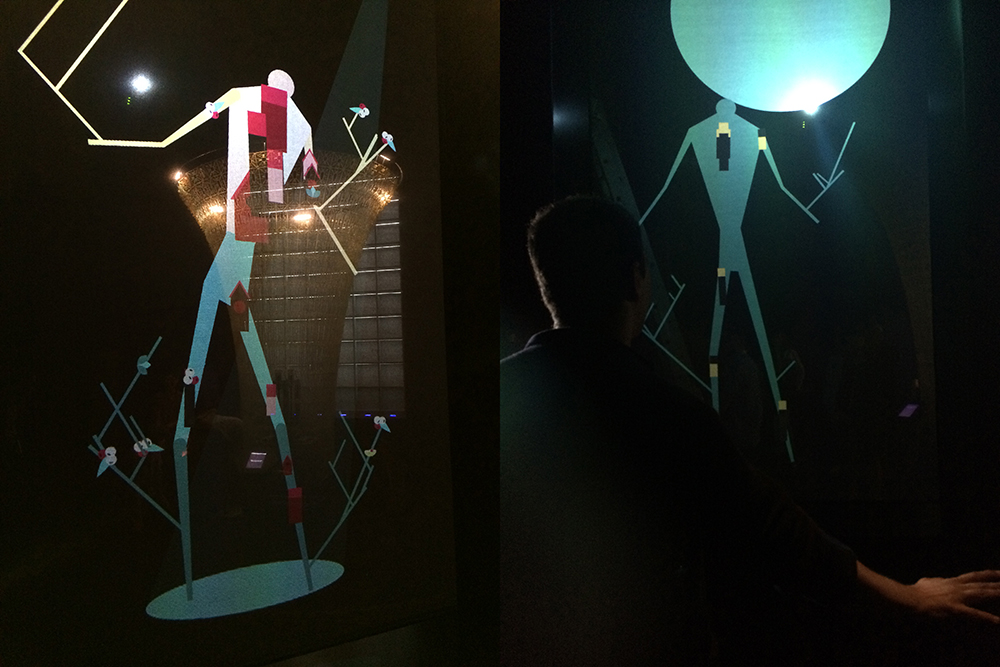
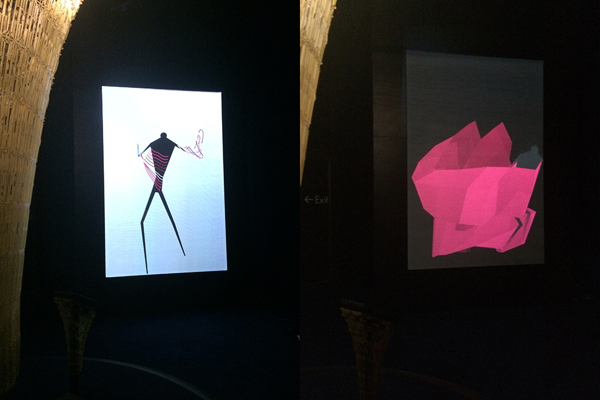
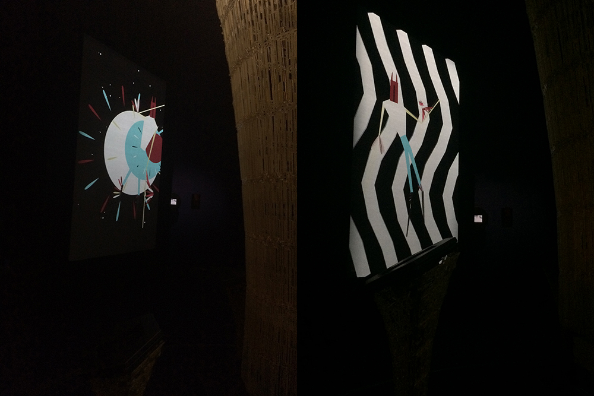

_by Béatrice_

Digital Revolution exhibition private view opening!

_Bird scene_

_Technology scene_

_Tribal scene_

_Louis Warinksky aka Chapelier Fou who created musics of mr. Kalia interacting_

_Zach Lieberman, Chapelier Fou, Stéphane Grégoire (Ici, d'ailleurs…) and Eric Bichon_

