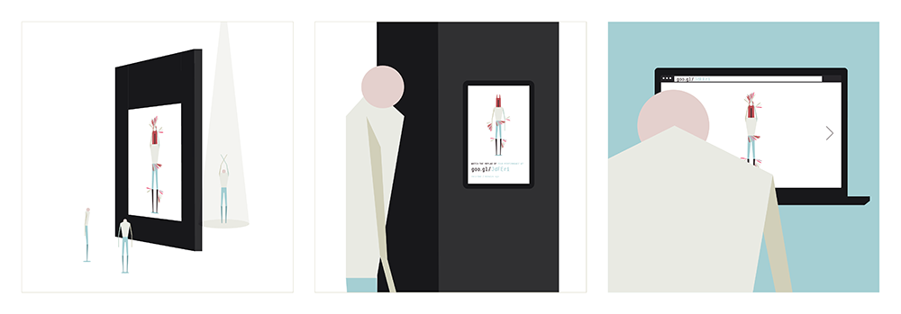

# Les métamorphoses de Mr. Kalia

## Authors

### • Cyril Diagne
Cyril Diagne plays a lot with different kind of technologies that he tries to merge with unconventional techniques and people to create unique experiences. Graduated from Les Gobelins in 2008 he studied graphic design, programming and then co-founded the collective lab212 along with 5 other students, where he is now a freelance creative technologist.

[Website](http://kikko.fr) | [Github](http://github.com/kikko) | [Twitter](http://twitter.com/kikko_fr) 

### • Béatrice Lartigue 
Béatrice Lartigue is an art director with a poetic and humanistic approach. She enjoys designing for people, regardless their age or their technological background. Béatrice likes having a global vision of the projects she’s working on, and using her skills in architecture to think about spaces around physical installations.

[Website](http://epure.it) | [Github](http://github.com/epure) | [Twitter](http://twitter.com/epure_)

### • About the authors

Béatrice and Cyril are both members of the collective **Lab212**. From UX design to graphic design, programming, electronics and technical design, they try to get involved in most aspects required by innovative interactive projects. From their sensible, poetic and tangible approach of interactive design, their projects try to empower users and cast a different light on the technology surrounding our daily lives. Through their creations, they invite people to think about our relation with the world we live in and the people we live with.

## Description
**_Les métamorphoses de Mr. Kalia_ (M. Kalia metamorphosis) is an interactive poetic adventure and a study of the concept of metamorphosis, the natural capacity of animals to abruptly change their body structure. To explore this topic, we invite the audience to personify Mr. Kalia as he goes through many surrealistic metamorphoses.**

Human bodies also face many different kinds of abrupt changes : unique or recurring, biological or artificial, physical or psychological, caused or inflicted. As a reflection of these human 'metamorphoses', each phase that Mr. Kalia goes through, conveys feelings related to change, evolution and adaptation.

Mr. Kalia can be brought to life by any person from the audience through the use of a skeleton tracking technology. The application provides various interactions that give different possibilities in progressing through the story, and a unique animated experience each time.

Imagined with simplicity in mind, this interactive installation is targeted to a broad range of people and can be installed in a wide variety of places. Also accessible from a web browser, people can watch the resulting animations live. 

#### Teaser

https://www.youtube.com/watch?v=L07v4rNvKKI

#### Website

You can (re)discover all performances on: **[DevArtmrKalia.com](http://www.devartmrkalia.com/)**.

## Links to External Libraries

**Skeleton Tracking :**

- [OpenFrameworks](http://www.openframeworks.cc)
- [OpenNI2 & NiTE2](http://www.openni.org)
- [ofxNi2](https://github.com/satoruhiga/ofxNI2)
- [ofxLibWebsocket](https://github.com/labatrockwell/ofxLibwebsockets)

**Front-end :**

- [Google Chrome](www.google.com/chrome)
- [Coffeescript](http://coffeescript.org)
- [Jade](http://jade-lang.com)
- [Stylus](http://learnboost.github.io/stylus)
- [Paper.js](http://paperjs.org)
- [Tween.js](https://github.com/sole/tween.js) 

**Back-end :**

- [NodeJS](http://nodejs.org)
- [Socket.IO](http://socket.io)

**Tools and workflow :**

- [Cake](http://coffeescript.org/documentation/docs/cake.html)
- [Paper.js sketchpad](http://sketch.paperjs.org)
- [SVG](http://www.w3.org/Graphics/SVG/)

